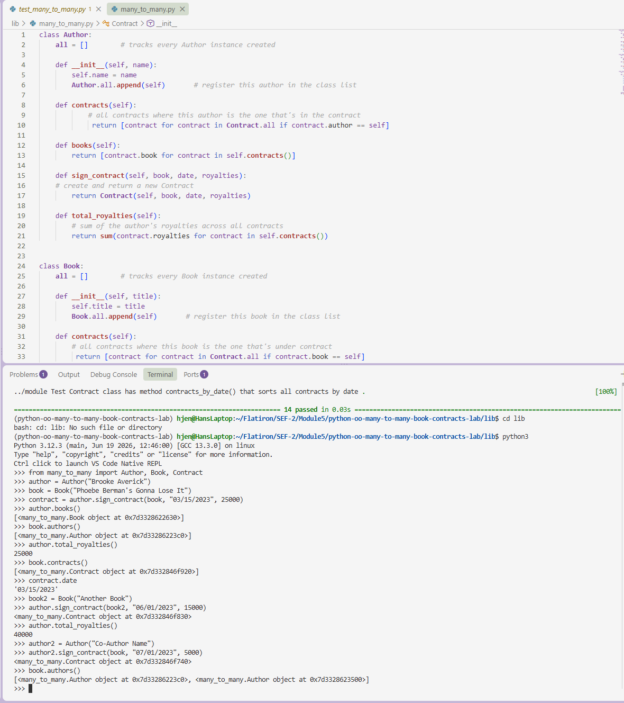

# Many-to-Many Relationships: Book Contracts Lab

A Python object model for managing book publishing contracts, demonstrating a
many-to-many relationship between `Author` and `Book` objects, joined through
a `Contract` class.

## Overview

An author can write many books, and a book can have many authors; this
relationship is represented through `Contract` objects, which link a specific
`Author` and `Book` together along with a signing date and royalty amount.

* **`Author`** — has a name and can sign contracts for books
* **`Book`** — has a title and can be tied to multiple authors via contracts
* **`Contract`** — the join between an `Author` and a `Book`, storing the
  date and royalties for that agreement, with validation to ensure each
  contract references a real `Author` and `Book`

## Screenshot



## Usage

```python
from many_to_many import Author, Book, Contract

author = Author("Brooke Averick")
book = Book("Phoebe Berman's Gonna Lose It")

contract = author.sign_contract(book, "03/15/2023", 25000)

author.books()            # books this author has contracts for
book.authors()             # authors tied to this book
author.total_royalties()   # total royalties earned across all contracts
Contract.contracts_by_date("03/15/2023")  # all contracts signed on a date
```

## Class Reference

### `Book`
| Member | Description |
|---|---|
| `title` | string, set on init |
| `Book.all` | class list of every `Book` created |
| `contracts()` | contracts where this book is under contract |
| `authors()` | authors tied to this book, via its contracts |

### `Author`
| Member | Description |
|---|---|
| `name` | string, set on init |
| `Author.all` | class list of every `Author` created |
| `contracts()` | contracts belonging to this author |
| `books()` | books tied to this author, via their contracts |
| `sign_contract(book, date, royalties)` | creates and returns a new `Contract` |
| `total_royalties()` | sum of royalties across all of this author's contracts |

### `Contract`
| Member | Description |
|---|---|
| `author`, `book`, `date`, `royalties` | validated on init (raises an exception if the wrong type is passed) |
| `Contract.all` | class list of every `Contract` created |
| `Contract.contracts_by_date(date)` | classmethod returning all contracts matching a given date |

## Testing

Run the test suite with:

```bash
pipenv install
pipenv run pytest
```

All 14 tests cover initialization, type validation, and the relationship
methods described above.

## Tools & Resources

* [Python classes documentation](https://docs.python.org/3/tutorial/classes.html)